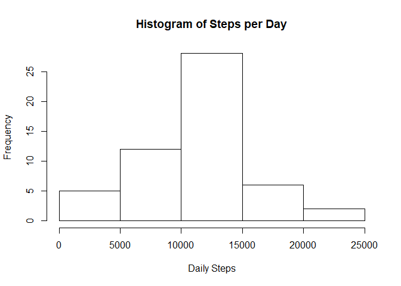
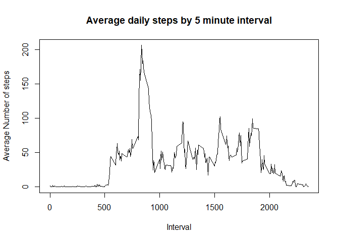
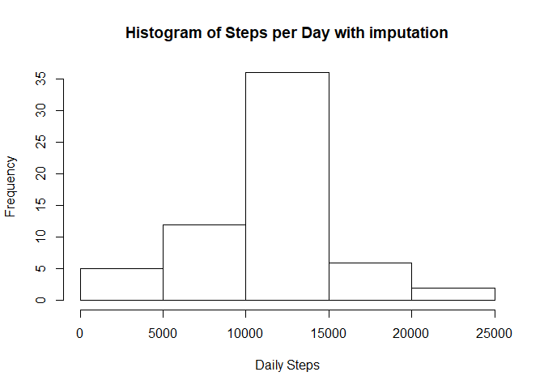

## Loading and preprocessing the data

```r
data <- read.csv(unz("activity.zip", "activity.csv"), header = TRUE,
                 sep = ",") 
# drop rows missing steps
data2<-data[!is.na(data$steps),]

# get date into date format
data2$date<-as.Date(as.character(data2$date,''),'%Y-%m-%d')
```

## What is mean total number of steps taken per day?

```r
step_day<-with(data2,aggregate(steps,by=list(date),sum,na.rm=TRUE))
names(step_day)<-c("date","steps")
hist(step_day$steps,main="Histogram of Steps per Day",xlab="Daily Steps")
```

<!-- -->

```r
#mean and median steps
mn_step<-round(mean(step_day$steps),0)
md_step<-round(median(step_day$steps),0)
```
Mean steps per day was 10766  
Median steps per day was 10765  

## What is the average daily activity pattern?

```r
## calculate mean for each interval
step_5<-with(data2,aggregate(steps,by=list(interval),mean,na.rm=TRUE))
names(step_5)<-c("interval","steps")
plot(step_5$interval,step_5$steps,type="l",xlab="Interval",
     ylab="Average Number of steps",main="Average daily steps by 5 minute interval")
```

<!-- -->

```r
#get max steps and interval
max_step<-max(step_5$steps)
max_int<-step_5[which.max(step_5$steps),1]
```
The interval with maximum steps was 835 with 
206m steps.  

## Imputing missing values

```r
# how many rows with missing values
num_miss<-sum(is.na(data))
#fill in missing values with mean for that interval
names(step_5)<-c("interval","mn_step")
data_update<-merge(data,step_5)
data_update$steps[is.na(data_update$steps)]<-data_update$mn_step[is.na(data_update$steps)]
# repeat histogram
step_day<-with(data_update,aggregate(steps,by=list(date),sum,na.rm=TRUE))
names(step_day)<-c("date","steps")
hist(step_day$steps,main="Histogram of Steps per Day with imputation",xlab="Daily Steps")
```

<!-- -->

```r
#mean and median steps
mn_step<-round(mean(step_day$steps),0)
md_step<-round(median(step_day$steps),0)
```
Mean steps per day was 10766  
Median steps per day was 10766  
The mean and median with imputation were nearly identical  

## Are there differences in activity patterns between weekdays and weekends?


```r
#format date
data_update$date<-as.Date(as.character(data_update$date,''),'%Y-%m-%d')
# chron has weekend function
library(chron)
```

```
## Warning: package 'chron' was built under R version 3.6.3
```

```
## NOTE: The default cutoff when expanding a 2-digit year
## to a 4-digit year will change from 30 to 69 by Aug 2020
## (as for Date and POSIXct in base R.)
```

```r
data_update$weekend<-as.integer(is.weekend(data_update$date))
#mean by weekend and interval
step_5split<-with(data_update,aggregate(steps,by=list(interval,weekend),mean,na.rm=TRUE))
names(step_5split)<-c("interval","weekend","steps")
step_5split$label[step_5split$weekend==1]<-"Weekend"
step_5split$label[step_5split$weekend==0]<-"Weekday"
#create plot
library(ggplot2)
```

```
## Warning: package 'ggplot2' was built under R version 3.6.3
```

```r
p<-ggplot(data=step_5split,aes(y=steps,x=interval))
p+geom_line()+facet_grid(label~.)
```

<!-- -->
  
  
The patterns do appear to be different for weekends and weekdays. People may get up earlier on weekdays and have less opportunity for steps during time at work. 

